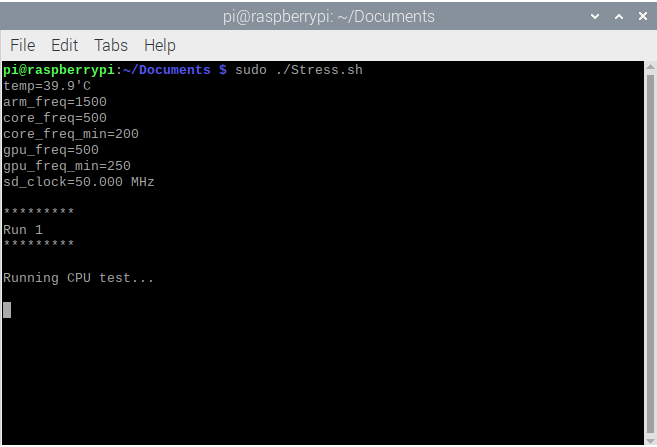

# Raspberry Pi 4/400 Stress Test

## Installation

Open a terminal and copy these commands:

``` bash
cd ~
git clone https://github.com/SuperPi911/Raspberry-Pi-4-400-Stress-Test/
cd Raspberry-Pi-4-400-Stress-Test
chmod +x Stress.sh
sudo ./Stress.sh
```

## Removal

Open a terminal and copy these commands:

``` bash
cd ~
sudo rm -r Raspberry-Pi-4-400-Stress-Test
```

## How it looks


